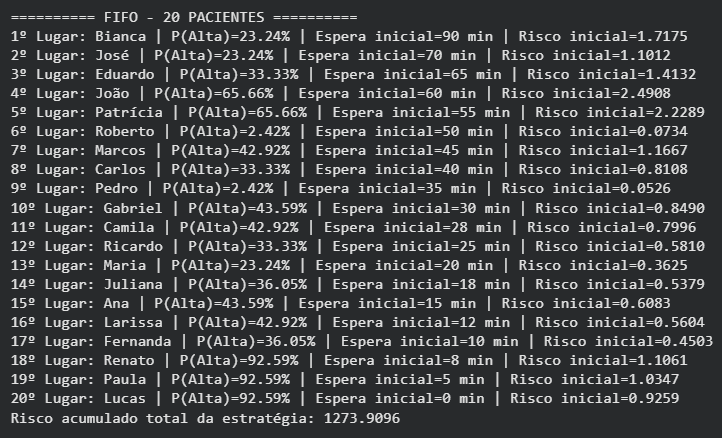
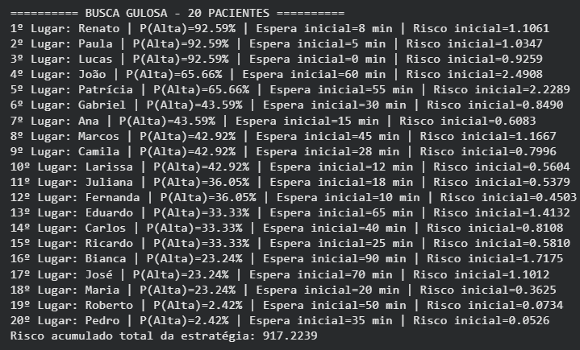
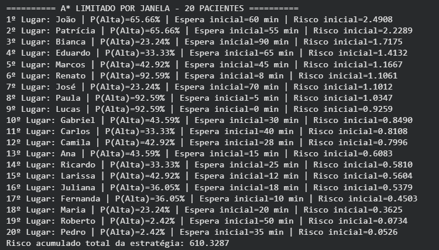
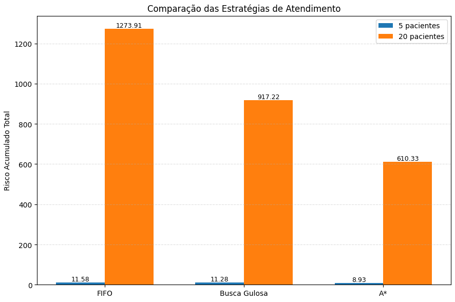

#  dynamic-hospital-triage-astar

> An intelligent, time-sensitive emergency department queue optimizer that evolves the traditional Manchester Triage System using Artificial Intelligence.


---

##  Overview

In real-world hospitals, the **Manchester Triage System** assigns static priority colors to patients based on initial vital signs. However, this system is inherently **static**: it does not automatically recalculate patient priority as they sit in the waiting room, which can lead to critical patient deterioration.

This project introduces a **Dynamic Manchester Triage System**. It uses a **Bayesian Network** to assess initial clinical severity based on discrete vital signs, combined with an **A* Search Algorithm** that models patient risk as an **exponential curve over time**. The system continuously predicts future deterioration to find the absolute mathematically optimal treatment agenda.

---

##  How It Works

The architecture relies on three core AI and data structure components to process each patient's parameters (**Fever**, **Oxygen Saturation**, **Blood Pressure**, and **Initial Wait Time**):

### 1. Clinical Severity Prediction (Bayesian Network)
Instead of relying on rigid manual rules, vital signs are fed into a Bayesian Inference Network. This calculates a dynamic probability of high severity:
$$P(\text{High Severity} \mid \text{Evidence})$$

### 2. The Exponential Deterioration Engine
Patient risk is not linear. A patient with moderate symptoms waiting for 2 hours might suddenly become a higher priority than a severe patient who just walked through the door. The core decision engine drives this behavior via the following exponential formula:

$$\text{Risk} = P(\text{High Severity}) \times e^{\frac{\text{Initial Wait} + \text{Simulated Time}}{\tau}}$$

*   **$\tau$ (tau):** Coefficient controlling the acceleration speed of the deterioration curve.

### 3. Chronological Decision Tree (A* Search + Beam Search)
The A* algorithm maps out an optimal scheduling tree where each node represents a 10-minute treatment interval. It evaluates paths using:
$$f(n) = g(n) + h(n)$$

*   **$g(n)$ (Accumulated Cost):** The real mathematical harm/risk already suffered by all patients left waiting during previous steps.
*   **$h(n)$ (Heuristic):** The predicted future risk of the remaining patients in the queue (`self.pacientes`).
*   **Beam Search Optimization:** Since scheduling grows factorially ($n!$), evaluating 20 patients generates over $2.43 \times 10^{18}$ combinations. The algorithm uses a `BEAM_WIDTH = 100` boundary constraint to prune the tree, keeping the execution lightning-fast and memory-efficient.

---

##  Search Strategies Breakdown

| Algorithm | Strategy / Core Metric | Pros | Cons |
| :--- | :--- | :--- | :--- |
| **FIFO (Baseline)** | Chronological order of arrival (`tempo_espera_inicial`). No heuristic. | Fair by arrival time; trivial to implement. | Completely blind to clinical severity. |
| **Greedy Search** | Immediate highest severity ($P(\text{Alta})$). Uses custom inverted negative logic on a `heapq`. | Extremely fast; handles the single worst case instantly. | Short-sighted (myopic). Completely ignores time, allowing older moderate patients to exponentially deteriorate. |
| **A* + Beam Search** | Minimizes total cumulative risk over time ($g(n) + h(n)$). | Mathematically balances clinical urgency with waiting room time. | Requires state-space search scaling constraints (Pruned via Beam Search). |

>  **The `heapq` Twist:** Python’s built-in `heapq` module acts as our priority queue manager. Because a `heapq` naturally pops the *smallest* value first, the Greedy Search algorithm passes a **negative sum of probabilities** (`-sum(p.p_alta)`) to inverted-index the heap structure. This effortlessly forces the heaviest clinical risks straight to the top.

---

##  Getting Started

### Prerequisites
Make sure you have Python 3.8+ installed along with the required scientific computing and probabilistic graphical model libraries:

```bash
pip install numpy pgmpy
python main.py
```

##  Deep Dive: 20-Patient Scenario Logs

To understand why the strategies perform so differently, we analyzed the console execution logs for each algorithm in the 20-patient scenario.

### 1. FIFO Baseline (Strictly Chronological)
<p align="center">
  
</p>

*   **The Log Behavior:** Patients are called based strictly on their initial waiting room time. **Bianca** (90 min wait, 23.24% severity) is called 1st, while highly critical patients like **Renato**, **Paula**, and **Lucas** (all at 92.59% severity) are left waiting at the very bottom (18th, 19th, and 20th places).
*   **The Consequence:** Leaving high-severity patients waiting for an extra 180 to 200 minutes while the queue clears causes their exponential risk curves to skyrocket, culminating in a disastrous total risk index of **1273.9096**.

### 2. Greedy Search (Myopic Severity)
<p align="center">
  
</p>

*   **The Log Behavior:** The algorithm pushes the highest risk directly to the top. **Renato**, **Paula**, and **Lucas** (92.59% severity) are successfully salvaged in the 1st, 2nd, and 3rd slots.
*   **The Consequence:** Because it is blind to time, it ignores moderate patients who have been sitting in the ER for over an hour. For instance, **Bianca** (90 min initial wait) is pushed all the way down to 16th place. By the time the algorithm finally gets to her, her risk has grown exponentially, dragging the total strategic risk to a high score of **917.2239**.

### 3. A* Search with Beam Search (Optimized Balance)
<p align="center">
  
</p>

*   **The Log Behavior:** This is where the mathematical balancing shines. Instead of blindly picking the longest wait or the highest current severity, A\* schedules **João** (65.66% severity, 60 min wait) and **Patrícia** (65.66% severity, 55 min wait) in 1st and 2nd place. 
*   **Why this works:** A\* realizes that their combined clinical risk and high wait times make them an explosive combination if left untreated. It safely delays the ultra-severe but fresh cases like **Paula** (5 min wait) and **Lucas** (0 min wait) down to 8th and 9th place, because their low elapsed time means their exponential curves haven't started spiking yet.
*   **The Outcome:** By dynamically managing the timeline, it saves both ends of the risk spectrum, achieving the absolute lowest total risk index of **610.3287**.

---

##  Benchmark Results

The chart below summarizes the **Total Accumulated Risk** across the different strategies. A lower index means less patient suffering and a safer waiting room environment.

<p align="center">
  
</p>

### Key Insights from the Data:
*   **Small Scale (5 Patients):** Even with few patients, A\* achieves the safest schedule with a total risk score of **8.93**, outperforming both FIFO (11.58) and Greedy Search (11.28).
*   **Large Scale (20 Patients):** In a crowded ER scenario, the traditional FIFO baseline scales dangerously up to a massive risk index of **1273.91**. 
*   **The AI Advantage:** The **A\* algorithm cuts the total risk by more than half** compared to FIFO, dropping it down to **610.33**. It also drastically outperforms the Greedy Search (917.22), proving that anticipating exponential timeline deterioration is mathematically safer than just treating the most severe current case.

---

##  License
This project is licensed under the MIT License - see the LICENSE file for details.
